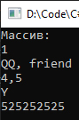

# Lesson11_task4
>Используя Visual Studio, создайте проект по шаблону Console Application.  
Создайте класс ArrayList. Реализуйте в простейшем приближении возможность использования его экземпляра аналогично экземпляру класса ArrayList из пространства имен System.Collections. 

Подытог: вот такенный майндфак на выходе
>
